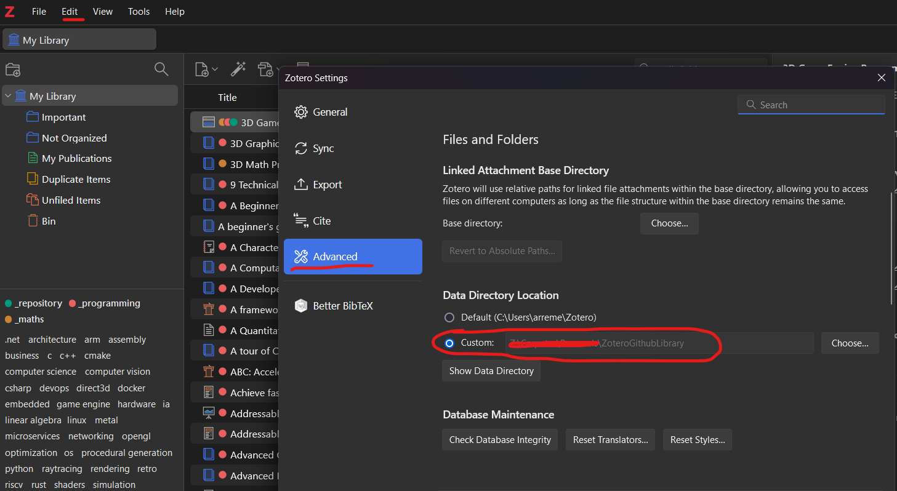

# The online library for programming enthusiasts!
This project is still work in progress, the main idea is to create an online library where programmers of all levels and skills can add and share their favourite resources. From videos to academic articles.

# Installation
We use Zotero as the indexer of all of this information. It's a nice program used by academics to organize their papers but I have found this application quite interesting!
You can download Zotero here: https://www.zotero.org/

To link this folder to your Zotero installation, you can use the following image as a guide:

What you need to do is tell Zotero where the data folder is located via Edit/Settings -> Advanced -> Data Directory Location -> Custom

# How to create a pull request:
The numbner one rule is that we do **NOT** upload PDF's or archives in this repository. Your resource entry should contain all the information you find "important" for others to see. Here is an example:

As you can see, this "Web Page" called 3D Game Engine Programming entry has the field "URL" filled with the website url. The abstract also describes what is the website about.

## Tags:
The repo uses tags to organize and categorize the entries.
A main tag is identified with an "_" underscore and is used to separate the main topics of the repo: Maths and Programming. In the future new main topics may be added.
The "Repository" tag is a special tag used for entries which act as repositories for other information, like the photo mentioned above.

# Current Stats:

| Topic        | Entries |
|--------------|---------|
| Total        | 204     |
| Programming  | 185     |
| C            | 23      |
| C++          | 27      |
| Maths        | 12      |
| Game Engines | 8       |
| C#           | 34      |
